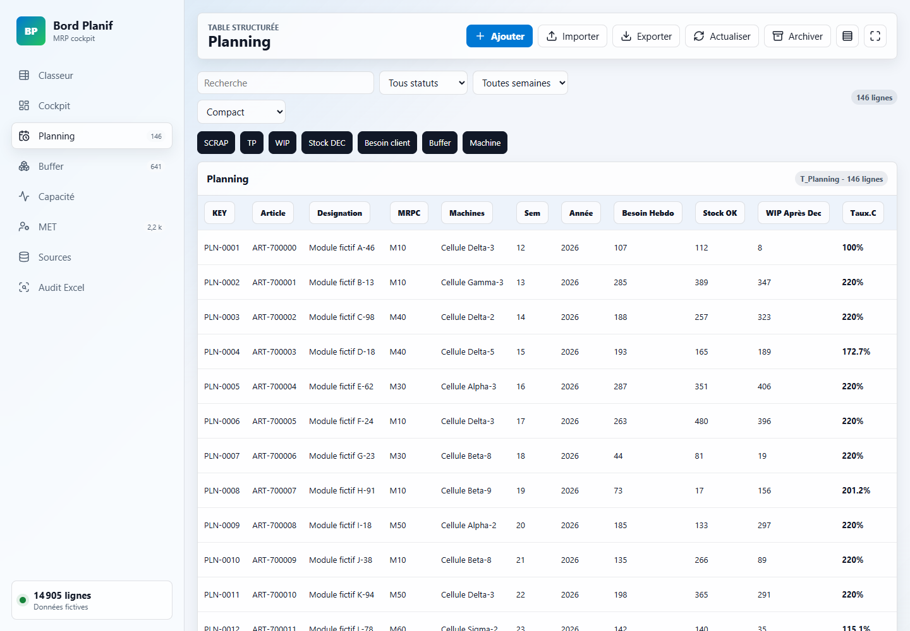
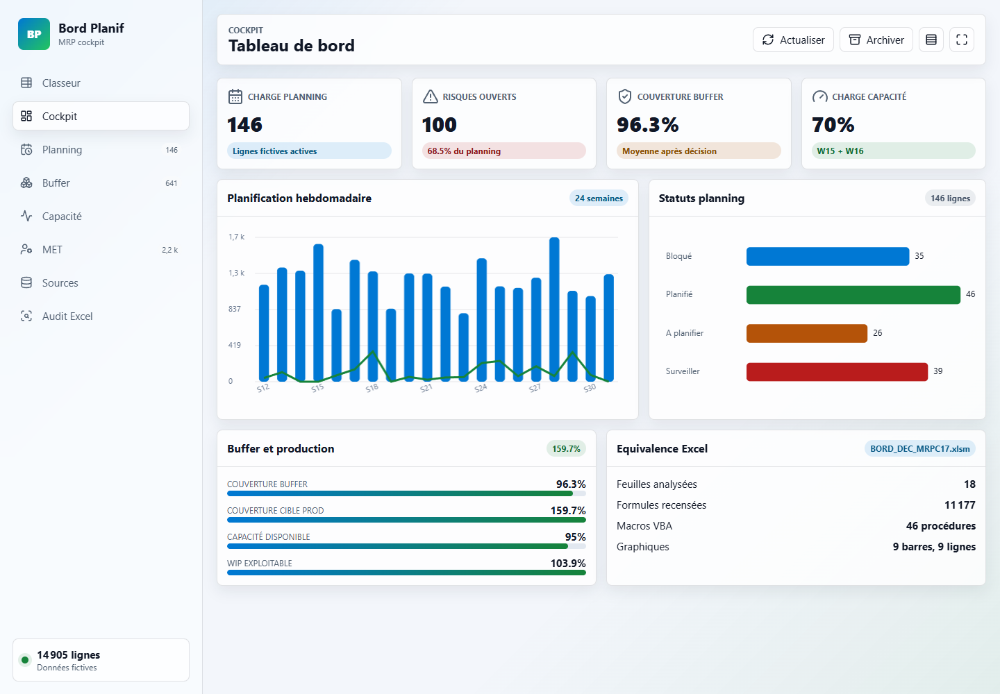

# Bord PLANIF - Toolkit de planification

## Statut de diffusion
Projet explique sur Site Ma Methode: la fiche publique peut presenter son utilite, ses fonctions, son avancement et ses liens disponibles.

## Liens vers l'application
- Application: non detecte
- GitHub: [https://github.com/RYJITS/bord_planif](https://github.com/RYJITS/bord_planif)

## Avancement du projet
- Etat du projet: pret cote usage public.
- Fonctionnement: fonctionnel.
- Securite: OK pour une presentation publique.
- Ma Methode: fiche explicative visible.
- Publication externe: GitHub public actif.

## A quoi sert le projet
Bord PLANIF est un toolkit de planification MRP. L'application aide a piloter un planning operationnel en regroupant les lignes a traiter, les statuts, les priorites, les capacites, les retards, les risques et les indicateurs utiles dans une interface claire. Elle sert a voir rapidement ce qui doit etre planifie, ce qui est bloque, ce qui est sous surveillance et ce qui peut etre archive.

## Fonctionnement de l'application ou du projet
L'application s'ouvre dans un navigateur et presente un cockpit avec indicateurs, ruban d'actions, vues specialisees, grille paginee, filtres et edition de lignes. L'utilisateur peut passer d'une vue planning a une vue capacite ou audit, filtrer les informations, modifier une ligne, simuler une actualisation, exporter les donnees en CSV ou creer un snapshot. Les changements restent sauvegardes localement dans le navigateur.

## Comment le projet a ete construit
Le projet est une application statique HTML, CSS et JavaScript concue comme un outil de pilotage leger. La logique cote client gere la navigation, les filtres, les calculs d'indicateurs, les graphiques, les heatmaps, les modales d'edition, l'import/export CSV et la persistance locale. Le jeu de demonstration reste fictif pour presenter les fonctions sans exposer de donnees sensibles.

## Installation et utilisation
### Installation
Aucune installation applicative standard n'est requise. Ouvrir index.html dans un navigateur moderne avec JavaScript active. Pour une utilisation plus confortable, le dossier peut aussi etre servi par un petit serveur local.

### Utilisation
Ouvrir l'application, choisir une vue, filtrer les lignes utiles, controler les indicateurs du cockpit, corriger ou completer les lignes de planning, puis exporter ou archiver un etat lorsque c'est necessaire.

## Fonctions disponibles dans l'application
- Cockpit KPI avec risques et indicateurs
- Navigation multi-vues de planification
- Filtrage multi-criteres par statut, semaine, recherche et groupe de colonnes
- Edition CRUD des lignes avec validation integree
- Recalcul dynamique des couvertures, capacites, buffers et retards
- Graphiques et heatmaps de charge
- Snapshots d'archive
- Import/export CSV
- Persistance locale des modifications
- Interface responsive compatible navigateur moderne

## Outils, IA et moteurs en arriere-plan
- HTML5, CSS3 et JavaScript vanilla
- Canvas pour les graphiques KPI
- localStorage pour la persistance
- Import/export CSV natif
- Architecture statique HTML/CSS/JS

## Automatisations integrees
- Generation du jeu de demonstration au chargement
- Recalcul des indicateurs apres edition
- Sauvegarde automatique des modifications dans localStorage
- Rendu dynamique des graphiques selon la vue active
- Simulation d'actualisation et journalisation des actions

## Captures d'ecran

## Mises a jour
- Fiche recentree sur l'usage de l'application
- Retrait du lien application incorrect
- Conservation du lien GitHub public correct
- Fiche recentree sur l'usage de l'application et non sur la reconstruction technique initiale
- Retrait du lien application incorrect tant qu'aucun lien public fiable n'est valide
- Lien GitHub conserve comme source publique correcte
