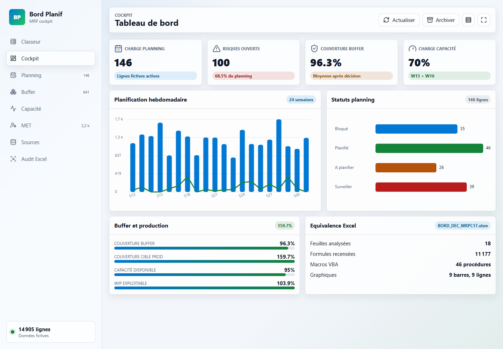
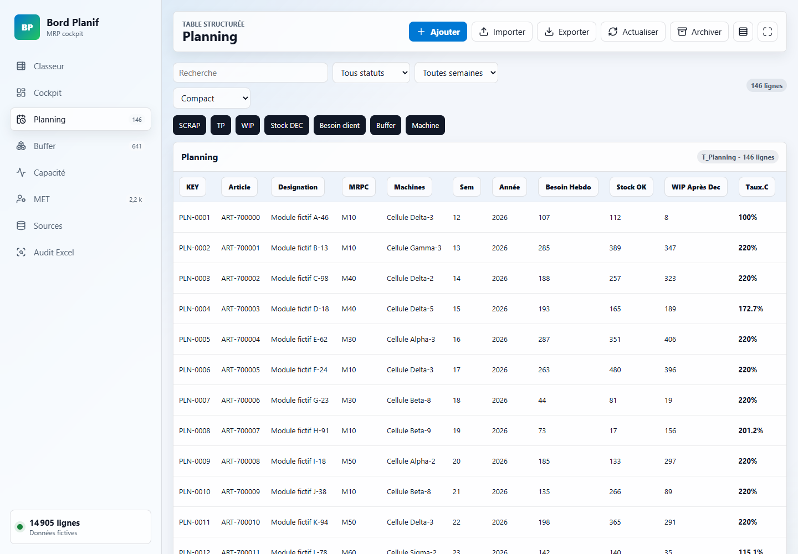

# Bord PLANIF

## Concept

Tableau de bord de planification autour d'un classeur metier. Il sert a organiser les lignes de suivi, les jalons, les priorites et les donnees utiles au pilotage.

Transformer un fichier de planification en cockpit lisible, suivi par l'orchestrateur et pret a etre relie au hub sans ecraser les donnees source.

## Fonctionnalites principales

- Reference le classeur de planification.
- Prepare une lecture plus visuelle des jalons et priorites.
- Garde le suivi orchestrateur et les statuts de publication separes.
- Peut etre presente dans le hub avec une vignette dediee.

## Installation locale

```powershell
# Aucune installation requise
```

## Lancement

```powershell
Start-Process .\index.html
```

## Captures d'ecran





## Variables d'environnement

Aucune variable d'environnement n'a ete detectee par l'orchestrateur.

## Securite

Ne jamais publier `.env`, tokens, sessions, logs sensibles, cles privees ou donnees personnelles.
